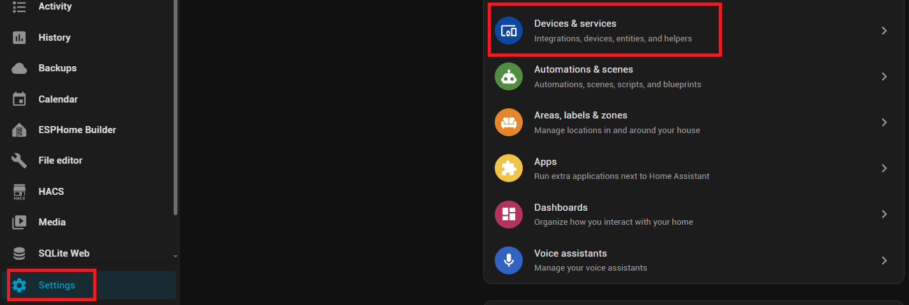
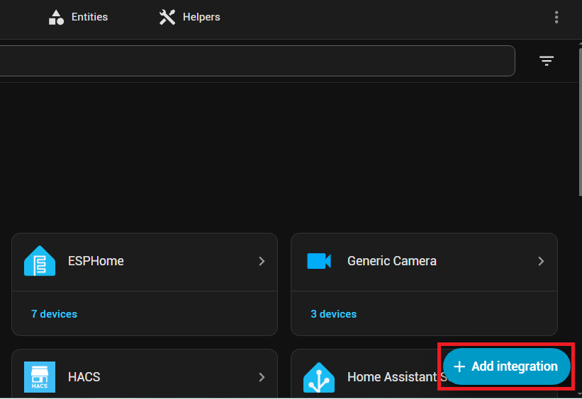
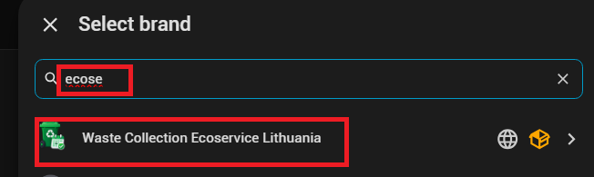
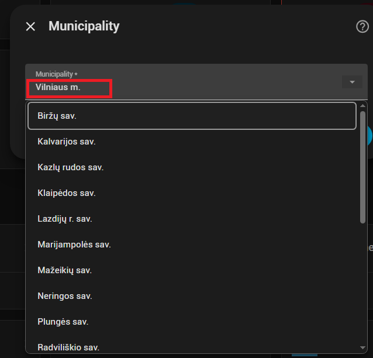
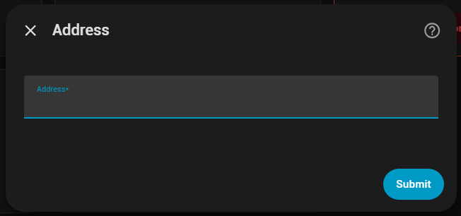
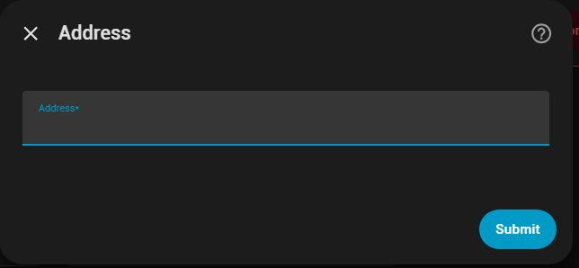

# Waste Collection Ecoservice Lithuania

Neoficiali „Home Assistant“ integracija, nuskaitanti viešai paskelbtą „Ecoservice“ atliekų išvežimo grafiką. Pasirinktinai ji gali prisijungti prie VASA savitarnos ir gauti faktinių aptarnavimų istoriją bei svorius. English documentation follows below.

## Reikalavimai

- „Home Assistant“ 2025.1 arba naujesnė versija;
- HACS arba galimybė rankiniu būdu kopijuoti `custom_components` katalogą;
- interneto ryšys su `ecoservice.lt`, `app.powerbi.com` ir „Microsoft Power BI“ viešos ataskaitos serveriais;
- VASA funkcijoms – įprastas `savitarna.vasa.lt` el. pašto ir slaptažodžio prisijungimas. El. valdžios vartai ir dviejų veiksnių patvirtinimas nepalaikomi.

## Diegimas per HACS

1. HACS → Integrations → trijų taškų meniu → Custom repositories.
2. Įrašykite `https://github.com/kubickasa/ecoservice_waste_collection`, tipas **Integration**.
3. Raskite **Waste Collection Ecoservice Lithuania**, įdiekite ir paleiskite „Home Assistant“ iš naujo.
4. Settings → Devices & services → Add integration → Waste Collection Ecoservice Lithuania.
5. Pasirinkite savivaldybę, įrašykite tikslų adresą ir pasirinkite konteinerius.

Atnaujinant integraciją HACS aplinkoje pasirinkite **Redownload**, o po atnaujinimo perkraukite „Home Assistant“.

### Rankinis diegimas

Nukopijuokite katalogą `custom_components/ecoservice_waste_collection` į savo HA konfigūracijos `custom_components` katalogą ir perkraukite HA. Galutinis kelias turi būti:

```text
/config/custom_components/ecoservice_waste_collection/manifest.json
```

## Konfigūravimas

### Integracijos pridėjimas Home Assistant

1. Atidarykite **Settings** ir pasirinkite **Devices & services**.

   

2. Lango apačioje paspauskite **+ Add integration**.

   

3. Paieškoje įrašykite `Ecoservice` ir pasirinkite **Waste Collection Ecoservice Lithuania**.

   

4. Pradėkite rašyti savivaldybės pavadinimą ir pasirinkite pasiūlytą variantą arba, nieko neįvedę, pasirinkite savivaldybę iš slenkamo sąrašo.

   

5. Pradėkite rašyti gatvę, namo numerį ar kitą adreso dalį ir pasirinkite pasiūlytą tikslų adresą. Nieko neįvedę galite slinkti per visą pasirinktos savivaldybės adresų sąrašą.

   

6. Paspauskite **Submit**. Pasirinktas adresas bus patikrintas viešoje ataskaitoje.

   

7. Pasirinkite vieną ar kelis su adresu susietus konteinerius.
8. Patikrinkite artimiausių išvežimų santrauką.
9. Jei reikia faktinių svorių, pažymėkite **Prisijungti prie VASA savitarnos** ir įveskite VASA el. paštą bei slaptažodį.

Nustatymus vėliau galima keisti integracijos **Configure** lange nešalinant integracijos.

## Sukuriami objektai

Sukuriamas vienas bendras kalendorius adresui ir kiekvieno konteinerio jutiklis „Dienų iki išvežimo“. Visi objektai priklauso vienam įrenginiui. Adresas ir inventoriniai numeriai lieka vietinėje HA instancijoje; telemetrijos nėra.

Pažymėjus **„Prisijungti prie VASA savitarnos“**, integracija kartą per parą paima pasirinktų konteinerių faktinio aptarnavimo istoriją: datą, aptarnavimo būseną, priežastį ir svorį. Iki 100 įrašų vienam konteineriui saugoma vietiniame HA `Store`. Papildomas jutiklis **„Paskutinis faktinis išvežimas“** rodo atliekų rūšį, o jo atributas `weight_kg` – paskutinį svorį.

Taip pat sukuriami einamųjų metų suminiai svorio jutikliai `this_year_paper_weight`, `this_year_glass_weight` ir `this_year_mixed_waste_weight`. Į sumą įtraukiami tik VASA įrašai, kurių aptarnavimo būsena yra „Aptarnautas“ ir pateiktas svoris.

- Vienas visos dienos įvykių kalendorius su visais pasirinktais konteineriais.
- Kiekvienam konteineriui – jutiklis, rodantis dienas iki artimiausio planinio išvežimo.
- Įjungus VASA – `Paskutinis faktinis išvežimas` ir trys einamųjų metų svorio jutikliai kilogramais.
- Konteinerio jutiklio `collection_history` atribute saugoma iki 100 naujausių VASA istorijos įrašų.

Tikslūs `entity_id` gali turėti adreso ar įrenginio priešdėlį ir gali būti pakeisti HA objektų registre. `unique_id` išlieka stabilūs.

Slaptažodis nepatenka į žurnalus ar jutiklių atributus. Jis saugomas vietiniame Home Assistant `ConfigEntry` (`.storage`) kartu su kitais integracijos nustatymais; HA tai nėra operacinės sistemos slaptažodžių saugykla, todėl būtina apsaugoti failų sistemą ir atsargines kopijas. VASA dviejų veiksnių ir el. valdžios vartų prisijungimas nepalaikomas.

```yaml
automation:
  - alias: "Priminti apie atliekų išvežimą"
    triggers:
      - trigger: numeric_state
        entity_id: sensor.ecoservice_paper_days_until_collection
        below: 2
    conditions:
      - condition: template
        value_template: >
          {{ states('sensor.ecoservice_paper_days_until_collection') | int(-1) == 1 }}
    actions:
      - action: notify.notify
        data:
          title: "Atliekų išvežimas"
          message: "Rytoj bus išvežamos popieriaus atliekos."
```

## Duomenų šaltinis ir diagnostika

Integracija naudoja tą pačią autentifikacijos nereikalaujančią „Microsoft Power BI Publish to web“ ataskaitą kaip `ecoservice.lt/grafikai`. Klientas iš viešo įterpimo dokumento atranda `resource key` ir klasterį, gauna `modelsAndExploration` bei `conceptualschema`, tuomet siunčia semantines užklausas į `querydata`. Tai nėra oficialus „Ecoservice“ API. „Microsoft“ ar ataskaitos savininkui pakeitus modelio laukus / išjungus Publish-to-web, integracija nustos atsinaujinti. Ankstesnis sėkmingas grafikas saugomas HA `Store`, bet objektai pažymimi nepasiekiamais iki kito sėkmingo bandymo.

Jei duomenys neatsinaujina, patikrinkite, ar ataskaita atsidaro naršyklėje, HA žurnalą pagal domeną `ecoservice_waste_collection`, ir paleiskite integraciją iš naujo. Žurnale tyčia nerodomas visas adresas, inventoriniai numeriai, užklausų turinys ar laikini identifikatoriai.

### Kaip veikia VASA dalis

1. Integracija autentifikuojasi tiesiogiai VASA API naudodama vartotojo pateiktus duomenis.
2. Iš prisijungimo sesijos gauna naudotojui prieinamas sutartis.
3. Pagal sutartį gauna rinkliavos objektus ir jų konteinerių lenteles.
4. Pasirinktiems konteineriams gauna išvežimo istoriją: datą, aptarnavimo būseną, priežastį ir svorį.
5. Tik būsena **Aptarnautas** įtraukiama į metines svorio sumas.
6. Duomenys atnaujinami kartą per 24 valandas ir saugomi vietinėje versijuotoje HA saugykloje. Laikinos klaidos metu ankstesnė istorija neištrinama.

### Dažniausios problemos

- **Savivaldybių ar adresų sąrašas tuščias:** patikrinkite, ar `https://ecoservice.lt/grafikai/` ataskaita veikia naršyklėje.
- **VASA jutikliai nepasiekiami:** patikrinkite el. paštą ir slaptažodį VASA svetainėje. Paskyros, kurioms reikia papildomo patvirtinimo, nepalaikomos.
- **Svoris lygus 0:** VASA gali pateikti nulį neaptarnautam bandymui; toks įrašas į sėkmingų išvežimų metinę sumą neįtraukiamas.
- **Po atnaujinimo neatsirado objektų:** perkraukite integraciją arba visą HA ir patikrinkite objektų registrą.

## Privatumas ir saugumas

- Telemetrija nesiunčiama.
- Adresas, konteinerių numeriai, VASA prisijungimo duomenys ir istorija lieka vietinėje HA instancijoje.
- Slaptažodis nerodomas objektų atributuose ar žurnaluose.
- HA `ConfigEntry` nėra atskira operacinės sistemos slaptažodžių saugykla, todėl apsaugokite `/config/.storage`, atsargines kopijas ir prieigą prie HA.
- Nekelkite diagnostikos failų į viešas problemas jų neperžiūrėję; juose gali būti adresų ar inventoriaus numerių.

## Žinomi apribojimai

- „Ecoservice“ dalis remiasi vieša „Power BI Publish to web“ ataskaita, o ne oficialiu stabiliu API.
- Ataskaitos modelio arba VASA vidinio API pakeitimai gali pareikalauti integracijos atnaujinimo.
- Labai dideli adresų ar istorijos sąrašai ribojami, kad nebūtų apkraunami išoriniai serveriai ir HA būsena.
- VASA el. valdžios vartų bei 2FA prisijungimas nepalaikomas.

## English

Unofficial Home Assistant integration for the public Ecoservice Lithuania collection report. Add `https://github.com/kubickasa/ecoservice_waste_collection` as a HACS custom integration, install it, restart Home Assistant, and configure it through Settings → Devices & services. It creates one all-day calendar for the address and one days-until-collection sensor per selected container.

The source is an unauthenticated Power BI Publish-to-web report, not an official supported API. The client discovers report metadata and queries its semantic model. Changes to the report schema, publication status, Power BI protocol, or result-size limits can break discovery. No telemetry is sent; address and inventory identifiers are stored only in the local Home Assistant instance.

Optional VASA login adds daily actual-service history and a latest actual collection sensor. Credentials remain in the local Home Assistant config entry and are never exposed through logs or entity attributes. VASA two-factor and government-gateway login are not supported.
